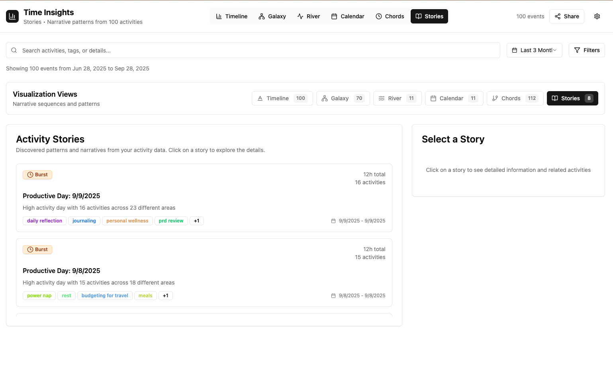

# SmartHistory - AI-Powered Activity Analytics Platform

> Transform your calendar and notes into beautiful, interactive visualizations with AI-powered insights.

## ✨ See It In Action

### 🎯 Intelligent Data Visualization

**River View** - Flow of your activities over time

*Watch your daily activities flow like a river, with AI-categorized events showing patterns and trends over time.*

**Galaxy View** - Explore activity relationships in space

*Navigate your activity universe where related events cluster together, revealing hidden connections in your work and life.*

**Timeline View** - Classic chronological perspective

*See your activities laid out chronologically with rich context and AI-generated tags for easy navigation.*

**Calendar Integration** - Enhanced calendar with AI insights

*Your familiar calendar view enhanced with AI-powered categorization and contextual information.*

**Stories View** - Narrative insights from your data

*Discover meaningful patterns and narratives automatically extracted from your activity history.*

**Chord Diagram** - Relationship network visualization

*Visualize the intricate relationships between different aspects of your life and work.*

### ⚙️ Powerful Settings & Control

**Smart Tagging Configuration**

*Fine-tune AI tagging behavior with custom categories, confidence thresholds, and processing rules.*

**Data Ingestion Control**

*Connect and configure your data sources - Google Calendar, Notion, and more - with simple, intuitive controls.*

**Intelligent Cleanup Tools**

*Keep your data organized with AI-powered cleanup suggestions and automated maintenance tasks.*

---

## 🚀 What Makes SmartHistory Special?

### 🤖 AI-Powered Intelligence
- **Smart Categorization**: Automatically categorizes activities using advanced AI
- **Context-Aware Tagging**: Enriches calendar events with relevant information from your notes
- **Pattern Recognition**: Discovers hidden patterns and relationships in your data

### 📊 Beautiful Visualizations
- **Multiple Perspectives**: View your data through different lenses - timeline, galaxy, river, and more
- **Interactive Exploration**: Drill down into specific time periods, categories, or relationships
- **Real-time Updates**: See changes instantly as you modify your calendar or notes

### 🔗 Seamless Integration
- **Google Calendar**: Full integration with your existing calendar
- **Notion Workspace**: Enriches events with context from your notes and projects
- **Extensible Architecture**: Easy to add new data sources

### 🎨 Modern Experience
- **Responsive Design**: Works beautifully on desktop, tablet, and mobile
- **Dark/Light Themes**: Choose your preferred visual experience
- **Professional UI**: Built with modern design principles for clarity and usability

---

## 🏁 Quick Start

Ready to explore your activity data? Check out our [Setup Guide](SETUP.md) for detailed installation and configuration instructions.

```bash
# Quick start (after setup)
./runner/deploy.sh local

# Access the app
open http://localhost:3000
```

---

## 🏗️ Architecture

SmartHistory combines multiple technologies to create a comprehensive activity analytics platform:

- **Frontend**: Next.js + TypeScript + Tailwind CSS
- **Backend**: FastAPI + Python
- **AI Engine**: Advanced language models for categorization and insights
- **Database**: SQLite for development, PostgreSQL for production
- **Integrations**: Google Calendar API, Notion API

---

## 📚 Documentation

- **[Setup Guide](SETUP.md)** - Complete installation and configuration instructions
- **[META/](META/)** - Detailed technical documentation
- **[Deployment Guide](deployment/DEPLOYMENT.md)** - Production deployment instructions

---

## 🤝 Contributing

We welcome contributions! Please see our documentation in the `META/` directory for development guidelines and project structure details.

---

**Transform how you understand your time. Start with SmartHistory today.**